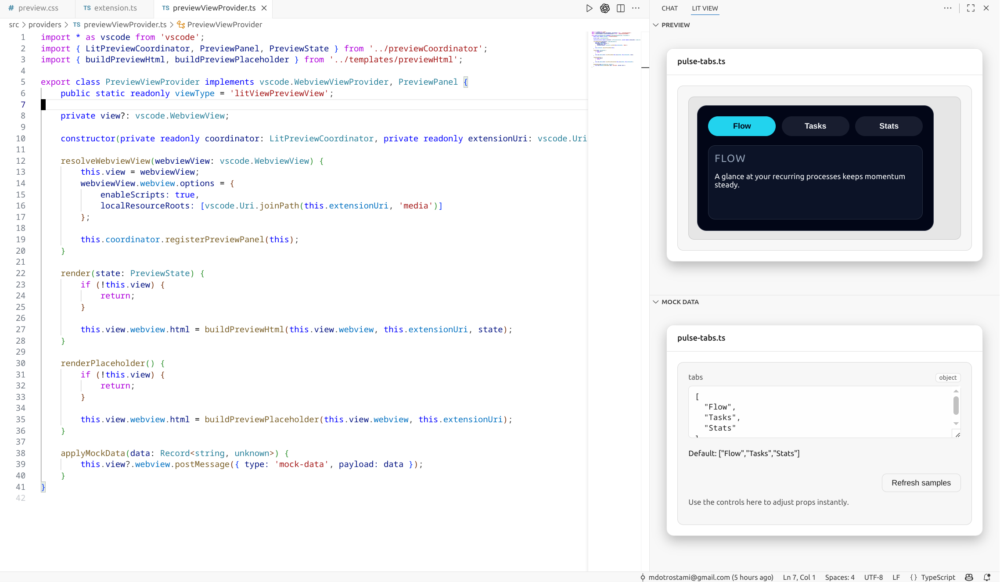

# Lit View

> Preview any Lit TypeScript component without leaving your editor—pin a live rendering and mock data editor to the right for instant feedback.

## Why builders love Lit View
- **Lightning-fast previews**: select a component in any `.ts` file, right-click (or hit the command palette) and watch a bundled, dependency-resolved version render beside your code.
- **Tweak without recompiling**: a mock data editor sits beneath the preview, inferring props/slots/events from `lit-element` metadata so you can keep editing JSON and see live updates.
- **Documentation-aware**: when available, Lit View surfaces Context7 MCP tips and snippets that relate to your active component without blocking the rendering pipeline.
- **Workspace-aware persistence**: recent components, mock presets, and the pinned preview state survive restarts so you can pick up where you left off.

## Feature highlights
- **Context-menu + Command palette**: preview a component directly from the explorer or from the currently open file (requires `resourceLangId == typescript`).
- **Preview & Mock panels**: the activity bar houses two webviews—`Preview` for rendering the component and `Mock Data` for adjusting inputs and tracking the dependency graph.
- **Bundled, sandboxed output**: esbuild resolves the component and its imports, treeshakes dev-only code, and loads the bundle inside a sandboxed iframe for safety.
- **Live dependency breadcrumbs**: inspect the component tree inside the preview header and drill into nested elements without leaving the panel.
- **Optional MCP docs helper**: Lit View queries the Context7 MCP server when available, but it stays fully functional offline or when the server is unreachable.

## Getting started
1. `npm install`
2. `npm run compile`
3. Launch the extension host from VS Code (F5 or the `Run Extension` configuration).

While developing, keep the build in sync:
- Run `npm run watch` to watch `src/` and keep `out/` updated.

## Core workflows
1. **Preview a component**: select text or open a Lit file, right-click and choose `Preview Lit File`, or invoke `Preview Lit File` from the command palette.
2. **Inspect dependencies**: breadcrumbs at the top of the preview show the resolved dependency tree; click through nested components.
3. **Tweak mock data**: use the mock editor to adjust props/attributes/events. Edits diff against the mounted component and re-render instantly.
4. **Stay in sync**: the panel reloads when the VS Code window gains focus or the active editor changes—no need to reopen the preview.
5. **Grab docs**: when Context7 access is configured, Lit View displays related documentation snippets right in the preview.

## Testing & examples
- `npm run check` runs ESLint plus the Node-based unit/smoke tests under `tests/`.
- Example Lit components live under `src/examples/` (`my-element`, `status-card`, `profile-inspector`); see `docs/examples.md` for usage tips.

## Release tasks
- `npm run package` produces a `.vsix` bundle via `vsce package`.
- `npm run release` runs `npm run check`, packages the extension, and pushes tags.
- Use `npm run bump:patch|minor|major` to bump semantic versions with pre-configured commit messages.

## Scripts
- `npm run compile`: `tsc -p ./`
- `npm run watch`: watches the TypeScript sources
- `npm run lint`: ESLint the `src/` tree
- `npm run test:unit`: runs the compiled tests via `node --test tests/**/*.test.js`

## Contributing
Report issues, suggest features, and open PRs via the [GitHub repository](https://github.com/mdotrostami/lit.view). Keep UI and docs in English for consistency.
